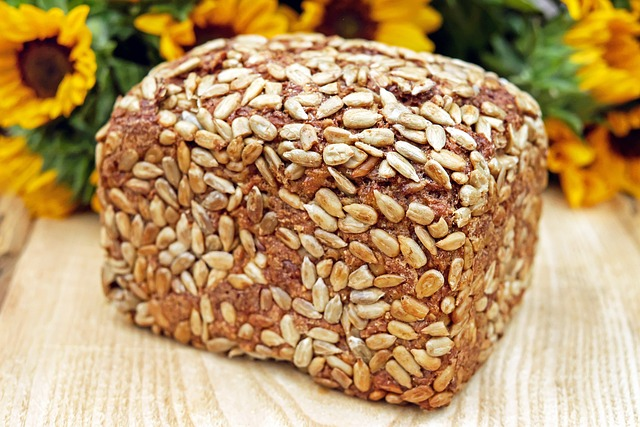
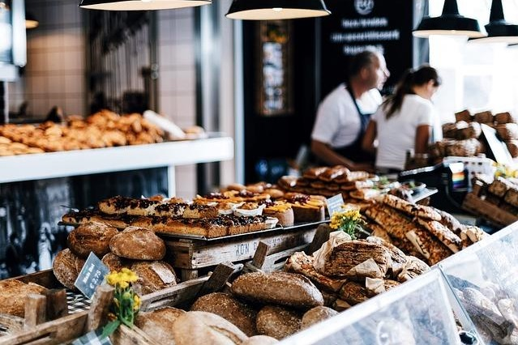
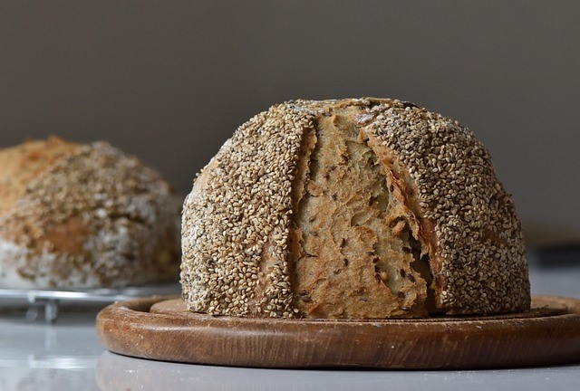

# Table of Contents

1. UX
	* Project Goals
	* Customers goals
	* Collaborators goals
	* User stories
	* Design choices
	* Wireframes

2.  Features
	* Existing features
	* Features left to implement

3. Technologies used

4. Testing

5. Deployment
	* How to run this project locally

6. Credits
	* Content
	* Media
	* Code
	* Acknowledgements

---

## Project Goals

The main project goal of Frasers Bakery website is to increase local awareness of a bakery that aims to be a hub for the local community. As this type of amenity will be used by everyone the website needs to be easy to navigate, understandable and legible with information that is easily obtainable. 

### Customer goals

The customer age range is a huge demographic, young children from potentially 10 years old all the way to the elderly.

Customer goals are:
* It needs easily accessible on all devices.
* Easy to navigate through the website.
* Easy to read and legible.
* Able to see images to what products are on offer.
* Social links to what the bakery is up to.
* Are able to visit the bakery in-person.

All these goals are possible due to:
* Responsive design is at the forefront of development.
* Continuity and modern HTML methods will be used through the project.
* Contrasting colours and easy to read fonts have been incorporated.
* There are several areas where social links are available.
* Address/interactive map will be available.

### Collaborators / Potential business partners

Collaborators goals are:
* Wanting to understand the companies story/background.
* Professional website feel but understands the clients needs.
* See what products are available.
* Where the bakery is situated.
* Social links to have a better understanding of the bakery.
* An area to submit project ideas/get in touch.

All these goals are met due to:
* A detailed story will be presented within the website.
* Products will be easily accessible through an easily located navigation bar.
* One of the main links in the navigation bar is "Where are we?" so that users can easily locate the bakery.
* A full section of the website is dedicated to "Work with us" which gives the user a feeling that the business is serious about working together.
* Social links are scattered through the website across all devices.

## Design Choices

The overall feel of the website will be designed to be simple but enjoyable to read. The following design choices were picked for these specific reasons:

### Fonts

- The primary font is **Noto Sans**. This was chosen for its readability. Good spacing between characters and suits the simplicity design aim. This font will make up the bulk on the writing where as the secondary will be for headings and titles.

- The secondary font is **Oswald**. This was chosen strict structure and that it would play well for being the dedicated font for the titles and headings.
- Both fonts that are mentioned will have a fall back of sans serif.

### Icons

The icons which will be present will be used for their metaphorically and literal meanings so they are understood by everyone.

### Colours

 - The primary background would be beige/flour feel to represent the bakery and heading/logo/title and text would be dark blue and light blue which would have a good contrast against the background. This should go with the design feature of being easily read.
 - A dark blue colour will be used as the line breaks and potentially the mobile heading bar.
 - The colour's which will be picked will be consistent through the project.

### Images

- The images which will be presented will be basic and to the point. Images will be of bakery goods and possibly what the bakery looks like.

### Styling

- All buttons and text boxes will be smoothly rounded to give the website a soft feel.
- Break rectangles will be present to be specific with when one section ends and one starts.
- The writing will nicely spaced to make it readable. Titles will be a decent amount of space between itself and the following writing or information (maps/images etc...). 

### Wireframes

I added the thankyou.html using the template of the other three and then adding a page-title with the text.

---
## Features

### Existing features

The basis of the website to simple to navigation and obtain information quick and easily. The main features would be:
  
- Navigation Bar
  - Featured on all three pages, the full responsive navigation bar includes links to the Home, Our Menu, Where are we? and Work with us? page and is identical in each page to allow for easy navigation.
  - This section will allow the user to easily navigate from page to page across all devices without having to revert back to the previous page via the ‘back’ button.
  - The Where are we? page is a smooth transition link to different section on the Home page.

- Who are we?
	- This will contain information about the bakery itself. A small piece of text containing information about the history.

- Social media icons
	- These will be present twice on the Home page to support the bakeries need for a increased social media presence. They will be big icons so the user can't miss them.

- Mailing list
	- This is present so the user can quickly involve themselves with offers and updates about the bakery without having to fill an entire form in.

- Where are we?
	- This contains information a google map and also the address of the bakery. This gives the user accessibility to find out where the bakery is.

- Leave us a wee review
	- This enables the user to leave a review of any kind for the bakery to improve their business and hear feedback. The submit button transports the user to a thank you page.

- Footer
	- The footer 

- Our Menu
	- This page is dedicated to the produce from the bakery and what is to offer. It allows the user to have an idea of what to expect when they come to the bakery themself. The menu has space to grow as well.
- Work with us
	- This page will allow allow companies and business work together with the bakery to support each others business and allow them to grow.
	- The presence of having a specific page will seem more professional.

I added unintended features when going through Bootstrap's documentation. I inputted in the carousel feature, along with the code from the documentation. This seems to be a good addition as it showcases the product from bakery to the user straight away.

## Technologies Used

### Languages Used
- [HTML5](https://en.wikipedia.org/wiki/HTML5)
- [CSS3](https://en.wikipedia.org/wiki/CSS#)

### Frameworks, Libraries & Programs Used

1. [Bootstrap 5.3](https://getbootstrap.com/docs/5.3/getting-started/introduction/)
	 - Bootstrap was used to assist with the responsiveness and grid layout design of the website.
2. [Google Fonts](https://fonts.google.com/)
	- I used both fonts which were mentioned that were from Google Fonts  which is used throughout the webiste.
3. [Git](https://en.wikipedia.org/wiki/Git)
	- Git was used for version control by utilising the Gitpod terminal to commit to Git and Push to GitHub.
4. [Balsamiq](https://balsamiq.com/wireframes/)
	- Balsamiq was used to create the wireframes for this project through the design process.
5. [Hover.css](https://ianlunn.github.io/Hover/)
	- hover.css was used on the navigation bar to create a fun grow and rotate effect on the tabs.

## Testing

The W3C Markup Validator and W3C CSS Validator Services were used to validate every page of the project to ensure there were no syntax errors:
- [W3C Markup Validator](https://validator.w3.org/)
- [W3C CSS Validator](https://jigsaw.w3.org/css-validator/)

### Testing User Stories from User Experience (UX) Section

- Customer Goals
	- As a customer i want to be able to navigate through the website and on my mobile while on the go.
		- The customer can access the website on all formats due to responsive testing.
		- The navigation bar is fixed at the top of every web page so that the customer can do through the website with ease.
	- As a customer I want to read the writing easily and look at the clear images of what the bakery has to offer.
		- The font is legible and the colour contrast is easy on the eye.
		- Images are not pixelated and have good spacing and the menu has its own page.
	- As a customer I want to see what the bakery is up to on a day-to-day basis and know its located if I happen to be out and about.
		- Social links are scattered throughout the website.
		- The address is available as well as a google map.  

- Collaborators/Business Partners Goals
	- As a collaborator/business partner I would want to understand the background and feel of the bakery
		- Background of the bakery is present on the home page for clients to read.
		- Fun but sophisticated font styling is used.
	- As a collaborator/business partner I would want to see what products are there to offer and where the bakery is situated
		- A full menu is present on it's own dedicated page.
		- The address is available as well as a google map. 
	- As a collaborator/business partner I want somewhere to put my idea forward about selling products together
		- There is a dedicated page for working together. This shows that the bakery is serious about working with the community and future collaborators.

### Further Testing

- The website has been tested on Google Chrome, Microsoft Edge and Opera.

- The website has been tested on all screen sizes and responsive media queries support this through the web developer tools.
- The website has been tested on a laptop and also on an iPhone.

All links which are present work:
- Social icons take the user to new tab with the requested webpage.
- The submit buttons on the forms take the user to a thank you webpage to show that link works.
- Navigation buttons at the top take the user to the correct part of the webpage.

### Known Bugs

On the menu.html, when the screen sized decreased the menu figcaption would shoot off to the right. I fixed this using a media queries when the screen got to this size:

There was another bug which caused an invisible gap along the right side to appear when the screen sized reached to mobile. I fixed by making the the wee review section to having a more responsive textarea which only had max-width 70% instead of touching the sides of the screen when the screen got to mobile view. This fixed it.

Another bug which I encountered was that the header with navigation icons was going under the carousel and also the images which had the hover over effect. To fix I did a bit of trial and error and swapped the z-index from container.header to fixed.header and worked.

## Deployment

### GitHub Pages
The project was deployed to GitHub Pages using the following steps...
1. Log into GitHub and locate the [GitHub Repository](https://github.com/FraserR1188/FrasersBakery)
2. At the top of the repository, under the title, locate the "Settings" tab on the menu.
3. Scroll down the Settings page until you locate a Pages section.
4. Under "Source", click the dropdown called "None" and select "Main".
5. Then wait until the page is ready to select on the right hand side of screen.

### Forking the GitHub Repository
By forking the GitHub Repository we make a copy of the original repository on our GitHub account to view and/or make changes without affecting the original repository by using the following steps...
1. Log in to GitHub and locate the [GitHub Repository](https://github.com/FraserR1188/FrasersBakery)
2. At the top of the repository, under the "Settings" tab on the menu. Locate the fork button.
3. Under "Owner," select the dropdown menu and click an owner for the forked repository.
4. By default, forks are named the same as their upstream repositories. Optionally, to further distinguish your fork, in the "Repository name" field, type a name.
5. Optionally, in the "Description" field, type a description of your fork.
6. Optionally, select **Copy the DEFAULT branch only**.
7. Click  **Create fork**.

More information about forking can be found [here.](https://docs.github.com/en/pull-requests/collaborating-with-pull-requests/working-with-forks/fork-a-repo)

### Make a Local Clone
To clone this project into Gitpod you will need:
1. A Github account. Create a Github account here. [https://github.com/](https://github.com/)
2. Use the Chrome browser.

Then follow

1. Log in to GitHub and locate the [GitHub Repository](https://github.com/FraserR1188/FrasersBakery)
2. Then select Code button and then under the Local tab copy the link in the HTTPS tab.
3. Open Git Bash.
4. Change the current working directory to the location where you want the cloned directory to be made.
5. Type git clone, and then paste the URL you copied in step 3.
6. Press Enter. Your local clone will be created.

More a more in-depth process click [here.](https://docs.github.com/en/pages/getting-started-with-github-pages/creating-a-github-pages-site)

## Credit

### Content

- Text came from https://www.violetcakes.com/about and then altered to suit the website.
- All images came from Pixabay.
- Address and map location is of: https://bigriverbakery.myshopify.com/pages/contact

### Media

https://pixabay.com/photos/tart-raspberries-whipped-cream-1283822/

https://pixabay.com/photos/cake-puff-pastry-desserts-currants-6491616/ 

https://pixabay.com/photos/bread-whole-wheat-bread-1510298/

https://pixabay.com/photos/bread-loaf-artisan-artisan-bread-1510155/

https://pixabay.com/photos/cinnamon-rolls-bread-spiral-baking-1417494/

https://pixabay.com/photos/bread-roll-bun-sweet-dessert-5916804/

https://pixabay.com/photos/bakery-breads-assorted-assortment-1868925/

https://pixabay.com/photos/breads-pastries-croissants-1867459/

https://pixabay.com/photos/loaf-evening-bread-bread-crust-7445434/

https://pixabay.com/photos/pretzels-baked-goods-food-bread-1491789/

https://pixabay.com/photos/bread-loaf-white-bread-baked-food-4642686/

### Code

I started with creating the index.html. I initially didn't have the header fixed with the navigation, this came later. I first got all the content for the header onto the screen. From the wireframes I wanted some sort of showcase of products as soon as the user was to go onto the website. I did some research and found the carousel documentation on Bootstrap. I then obtained all the images from Pixabay. These image can be found in the media section. Once the images were uploaded to the Gitpod I then implemented the carousel.
I encountered my first bug with the carousel. Once the nav was fixed and followed the screen scroll, it would go behind the carousel pictures. I then gave the nav a z-index of 999 but it would still go behind. I then targeted the carousel and gave it 0, didn't work, I then gave it -1 and the nav would go over the top but it disabled the buttons on the carousel. The carousel slides automatically cycle through and the menu can be seen through another link so I'm not too fussed about losing the buttons.
The header is the same throughout the website and so it the footer. The footer contains the social icons and also terms and conditions with Robbie Fraser copyright.

I created a clear page divider to divide the different sections on the website. This is used throughout the website.

I used Bootstraps grid layout for the majority of website apart from the address section which contains the map and address. I used flex and flex-wrap so that it was responsive on all screen sizes. I watched a video to have a better understanding of flex-box which is in the Credits section.

I used the icons on Bootstrap to be used in the website as they are supported and look good. I made sure they were present twice on the index.html since having a bigger social presence was key from having this website.

The menu.html is to showcase the main products from the bakery. The way the html contents is laid out, more products can be easily added with the same grid system. 

The workwithus.html is designed to specifically target with future business partners. This separate page should make it seem more serious rather than an after note on the index or even menu. 

I also created a thankyou.html which is used when the user clicks on the submit button to show that the form works,

I originally only had dark blue/beige and black to use throughout the website but I wanted another colour for long text. I decided to go with dark green #003844. Another dark colour with the beige brings warmth to the page. I originally had the page divider on 40px but I've changed it to 70px to make them stand out more and try to make it more eye-catching. I also had the social icons as the same colour as page divider but then changed it to what the long text font is to make them standout more.

I wanted a blend of Bootstrap and custom HTML/CSS to show that I work with both and that both can work together. ASs mentioned before the majority of the layout on all the pages are using Bootstrap's grid system which works really well and is very responsive, especially with images. The only section was with the embedded map and the address which I used flex and flex-wrap. I used Bootstraps default buttons throughout but I did keep the code for an original custom which I found and was going to used but I preferred Bootstraps buttons.

This gave me a better understanding of flex-box:
[Flexbox](https://www.youtube.com/watch?v=wsTv9y931o8&t=524s)

[https://www.w3schools.com/howto/tryit.asp?filename=tryhow_css_buttons_fade1](https://www.w3schools.com/howto/tryit.asp?filename=tryhow_css_buttons_fade1)
This gave me the code for a smooth fade effect over the button which I could use in the future.

This video gave me a better understanding of how to use the Bootstrap grid system:
[https://stackoverflow.com/questions/35163164/how-to-center-content-in-a-bootstrap-column](https://stackoverflow.com/questions/35163164/how-to-center-content-in-a-bootstrap-column)

I was looking through tutorials in YouTube for inspiration and stumbled across this which was a simple but effective short piece of code:
[Smooth scroll](https://www.youtube.com/watch?v=Xc6G3oV24yE) This enabled me to smoothing transition to the "Where are we" section of the website instead of jumping.

Bootstraps documentation helped a lot through this project and it showed me how to do the carousel imagery on the index.html. I also created my own navbar and not use Bootstraps default. This was purely to show that I can create the code for a fixed positioned navigation bar with fade effects on the writing.

An addition to the navigation bar links was from hover.css:
https://ianlunn.github.io/Hover/#effects
This created a grow and then rotate which is a nice, small design feature from an user experience POV.

I also implemented a hover overlay effect on the two main images in the index.html to enhance the user experience. The content which goes over the images when hovered just gives the user more information about the bakery.
https://www.w3schools.com/howto/howto_css_image_overlay.asp

I have used three different pixel widths for media queries which work well with the webpage. I used this video to give me a better understanding:
[Media Queries](https://www.youtube.com/watch?v=K24lUqcT0Ms)

I used this website to help me implement a fixed header:
[https://www.tutorialrepublic.com/faq/how-to-create-fixed-header-or-footer-using-css.php](https://www.tutorialrepublic.com/faq/how-to-create-fixed-header-or-footer-using-css.php)

## Acknowledgements

Thank you for my mentor's help to guide me the way to a decent first project.
